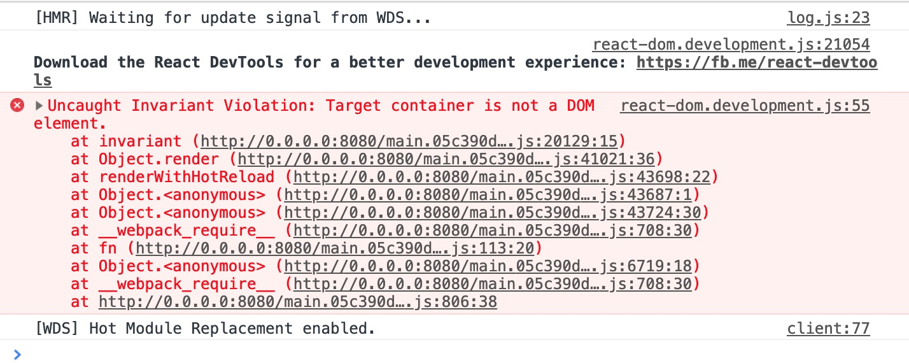

# React-Family
从零初步搭建及学习 React. start at 2019-03-04 Mon.

### 参考地址
1. [从零搭建 React 全家桶框架教程](https://github.com/brickspert/blog/issues/1#hot-module-replacement)
2. [入门教程：认识React](https://zh-hans.reactjs.org/tutorial/tutorial.html)

### 启动项目

按照以下命令依次执行后，访问 `http://localhost:8080`

```
git clone git@github.com:linzhenzhen/react-family.git
cd react-family/
npm install
npm start
```

### 以下是练习中遇到的问题

1. Uncaught Invariant Violation: Target container is not a DOM element.



`解决` 在 src/index.html 内容处插入一个 js 引入，然后刷新或者从新编译刷新页面就可以了，很神奇的修复了这个问题。[详见参考链接 @Mandy94](https://github.com/storybooks/storybook/issues/2615#issuecomment-405088812)

