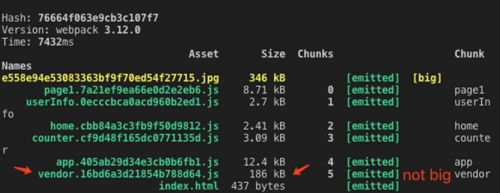
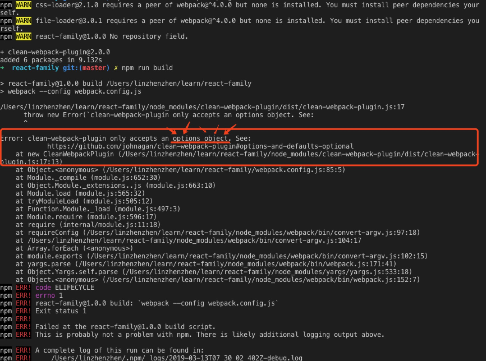

# React-Family
从零初步搭建及学习 React. start at 2019-03-04 Mon.

根据第一篇参考地址作为实践练习，但因每个人电脑环境和开发工具不同，在练习过程中遇到很多报错的现象，所以来这里做个记录，已备日后查看。

### 参考地址
1. [从零搭建 React 全家桶框架教程](https://github.com/brickspert/blog/issues/1#hot-module-replacement)
2. [入门教程：认识React](https://zh-hans.reactjs.org/tutorial/tutorial.html)

### 启动项目

按照以下命令依次执行后，访问 `http://localhost:8080`

```
git clone git@github.com:linzhenzhen/react-family.git
cd react-family/
npm install
npm start
```

### 以下是练习中遇到的问题

1. Uncaught Invariant Violation: Target container is not a DOM element.


`已解决` 在 src/index.html 内容处插入一个 js 引入，然后刷新或者从新编译刷新页面就可以了，很神奇的修复了这个问题。[详见参考链接 @Mandy94](https://github.com/storybooks/storybook/issues/2615#issuecomment-405088812)

2. TypeError: Cannot read property 'compilation' of undefined.


`已解决` 这个是在练习文件压缩使用 webpack 的 uglifyjs-webpack-plugin 时 build 报错的。因为 `webpack@3 requires uglifyjs-webpack-plugin@1`, 所以解决办法是重新安装 `uglifyjs-webpack-plugin@1`。[详见参考链接 @evilebottnawi](https://github.com/webpack-contrib/uglifyjs-webpack-plugin/issues/360#issuecomment-423567387)

3. 对比使用 `uglifyjs-webpack-plugin` 压缩前后的文件大小图，其中有些文件还是有明显的缩减的。

压缩前文件大小截图


压缩后文件大小截图


4. 增加指定 `process.env.NODE_ENV === 'production'` 环境时，vendor 文件变小了，我练习时还没能领会怎么变小的，先贴图记录。



5. Error: clean-webpack-plugin only accepts an options object.



`已解决` 这个问题是因为加了 "new CleanWebpackPlugin(['dist'])" 后报错的，看报错的意思是括号里面应该是个 Object，所以传的是错的 Options。如果没什么要求，解决方式就是不传任何内容，即直接注入 "new CleanWebpackPlugin()"就行了。经过删除 dist 的文件，之前的 api/user.json 也不在了，所以要用的话，需要在重新新建一下。 [详见 CleanWebpackPlugin 的参数](https://github.com/johnagan/clean-webpack-plugin#options-and-defaults-optional)

6. 